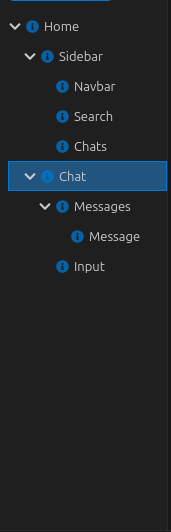
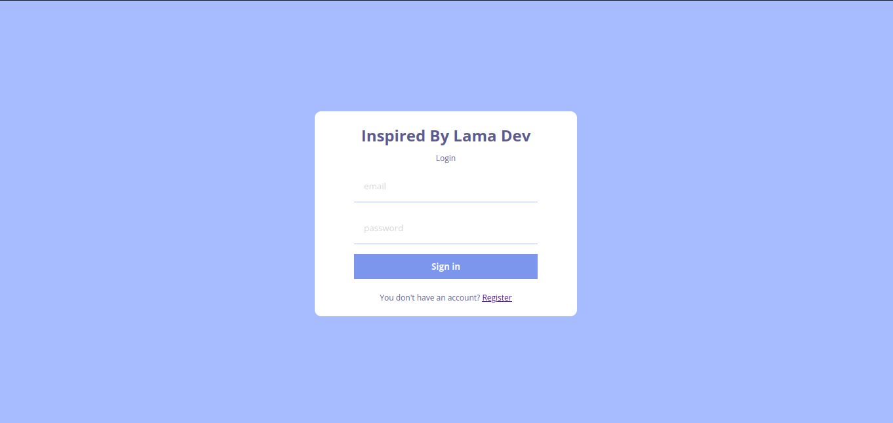
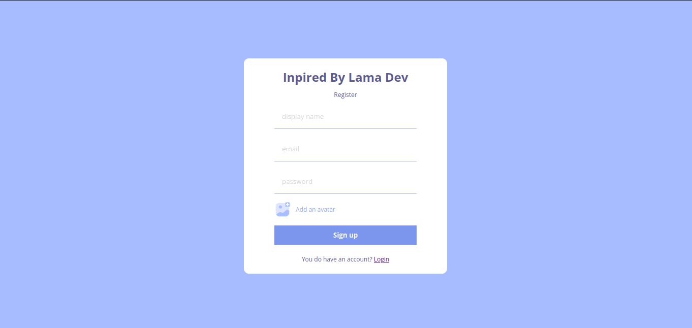
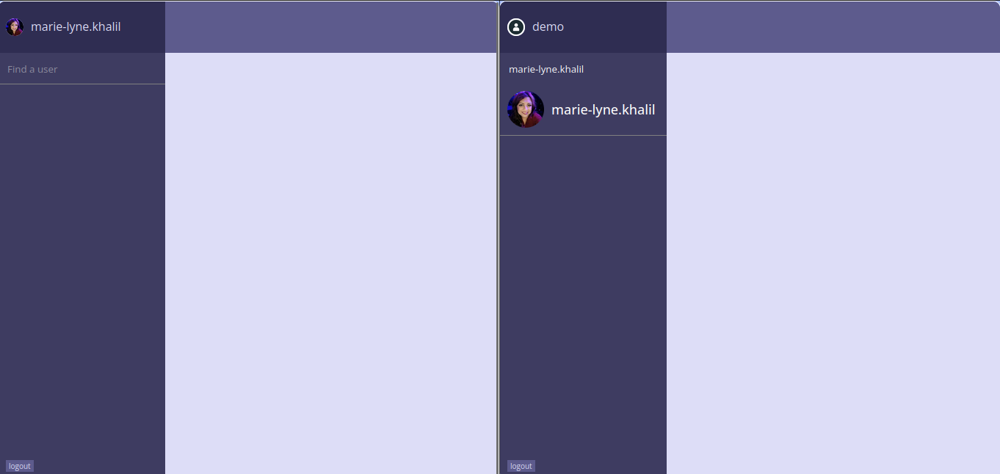
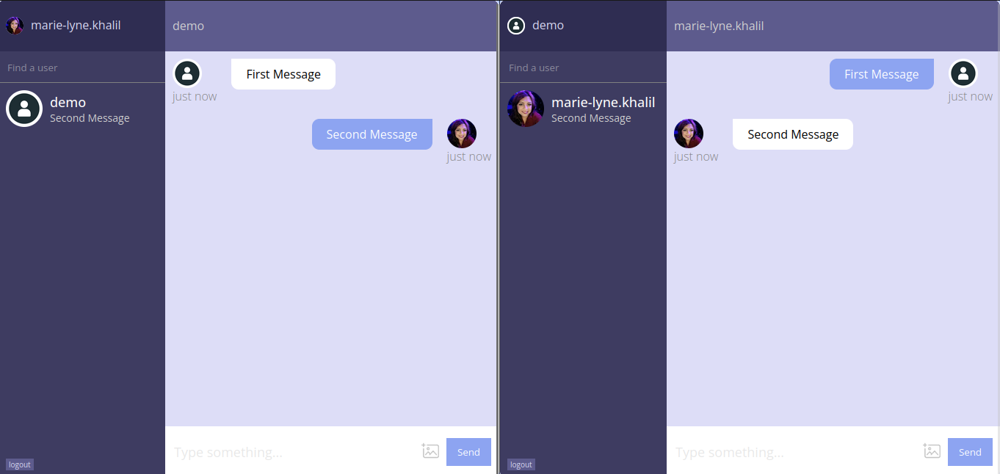
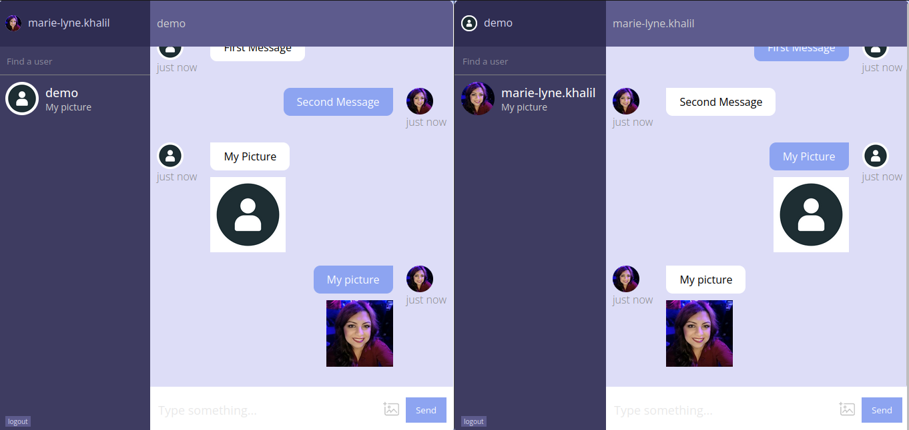

# React Chat Using Firebase Inspired By Lama Dev

## Project Screenshots

### Component Tree

### Login


### Signup


### Search for User


### Sending a Message


### Sending Pictures


## 1.Folder Structure 

```bash
├── App.js
├── components
│   ├── Chat.jsx
│   ├── Chats.jsx
│   ├── Input.jsx
│   ├── Message.jsx
│   ├── Messages.jsx
│   ├── Navbar.jsx
│   ├── Search.jsx
│   └── Sidebar.jsx
├── context
│   ├── AuthContext.js
│   └── ChatContext.js
├── firebase.js
├── img
│   ├── addAvatar.png
│   ├── add.png
│   ├── attach.png
│   ├── cam.png
│   ├── img.png
│   └── more.png
├── index.js
├── pages
│   ├── Home.jsx
│   ├── Login.jsx
│   └── Register.jsx
└── style.scss
```

## 2.Setup & Installation

Unfortunately, during the inception of the project, `npx create-react-app` was the tool of choice. However, in the evolving landscape of React development, it's now recommended to use one of the more advanced React frameworks like Next.js. To initialize a new project, you can use the following command:
```bash
npx create-next-app@latest
```
This will set up a new Next.js project, providing enhanced features and optimizations for your React application.

## 3.Setting Up Firebase

This project utilizes Firebase services for various functionalities. To get started with Firebase, please follow the steps below:

1. **Create a Firebase Project:**
   - Visit the [Firebase Console](https://console.firebase.google.com/).
   - Click on "Add Project" and follow the setup instructions.

2. **Set Up Firebase Config:**
   - Obtain your Firebase configuration by navigating to Project Settings > General > Your Apps > Firebase SDK snippet.
   - Copy the configuration details.

3. **Configure the Project:**
   - Create a `.env` file in the project root.
   - Paste the Firebase configuration into the `.env` file.

    ```dotenv
    REACT_APP_FIREBASE_API_KEY=<your-api-key>
    REACT_APP_FIREBASE_AUTH_DOMAIN=<your-auth-domain>
    REACT_APP_FIREBASE_PROJECT_ID=<your-project-id>
    REACT_APP_FIREBASE_STORAGE_BUCKET=<your-storage-bucket>
    REACT_APP_FIREBASE_MESSAGING_SENDER_ID=<your-messaging-sender-id>
    REACT_APP_FIREBASE_APP_ID=<your-app-id>
    ```

4. **Install Firebase :**
   ```bash
   npm install firebase
   ```
## 4.Initializing Firebase

1. Create a new file named `firebase.js` within the `src/` directory.

2. Insert the Firebase configuration code, as prescribed in the official Firebase documentation. This configuration code is pivotal for seamless interaction between your application and Firebase services.

    ```js
    import { initializeApp } from "firebase/app";
    import { getAuth } from "firebase/auth";
    import { getStorage } from "firebase/storage";
    import { getFirestore } from "firebase/firestore";


    const firebaseConfig = {
    apiKey: process.env.REACT_APP_FIREBASE_API_KEY,
    authDomain: process.env.REACT_APP_FIREBASE_AUTH_DOMAIN,
    projectId: process.env.REACT_APP_FIREBASE_PROJECT_ID,
    storageBucket: process.env.REACT_APP_FIREBASE_STORAGE_BUCKET,
    messagingSenderId: process.env.REACT_APP_FIREBASE_MESSAGING_SENDER_ID,
    appId: process.env.REACT_APP_FIREBASE_APP_ID,
    };

    export const app = initializeApp(firebaseConfig);
    export const auth = getAuth();
    export const storage = getStorage();
    export const db = getFirestore();

    ```
## 5.Activating & Setting Up Firebase(Auth, Storage, Firestore)

### Auth
    1. Navigate to the [Firebase Console](https://console.firebase.google.com/).
    2. Go to the 'Authentication' section.
    3. Select the 'Sign-in method' tab.
    4. Enable the 'Email/Password' option.
### Storage
To activate Firebase Storage for your project, follow these steps:
1. **Go to the Firebase Console:**
- Visit [Firebase Console](https://console.firebase.google.com/).
2. **Select Your Project:**
- If you have multiple projects, select the project you are working on.
3. **Navigate to Storage:**
- In the left-hand menu, click on "Storage." This will take you to the Firebase Storage section.
4. **Set Up Storage:**
- If it's your first time setting up Firebase Storage for the project, you will be prompted to get started. Click on the "Get Started" button.
5. **Choose a Location:**
- Select the location where you want to store your data. This choice can impact data latency and compliance with regional data regulations.
Certainly! If you want to instruct users to replace the default storage rules with specific rules, you can phrase it like this:

"6. **Update Storage Rules:**
   - Replace the default rules in the Firebase Console (while in Storage go to rules) with the following rules.
```js
rules_version = '2';
service firebase.storage {
  match /b/{bucket}/o {
    match /{allPaths=**} {
      // Customize these rules based on your security requirements
      // Allow or restrict read and write access as needed
      allow read, write;
    }
  }
}
```
7. **Complete the Setup:**
- Follow any additional prompts or instructions to complete the Firebase Storage setup.
8. **Integrate with Your Project:**
- Now that Firebase Storage is set up, you can start integrating it into your project. Obtain the necessary configuration details, such as the storage bucket URL, for use in your application.

### Firestore
Creating three Firestore collections: `users`, `userChats`, and `chats`, each with autogenerated document IDs:

```markdown
To set up the Firestore database for this project, follow these steps:
1. **Navigate to the Firestore Console:**
   - Visit the [Firestore Console](https://console.firebase.google.com/).
2. **Select Your Project:**
   - If you have multiple projects, select the project you are working on.
3. **Create the 'users' Collection:**
   - In the left-hand menu, click on "Firestore Database."
   - Choose "Create Collection" and name it 'users.'
   - Generate a unique ID.(press Auto-ID and remove columns other then Auto-ID)

4. **Create the 'userChats' Collection:**
   - Similarly, create another collection named 'userChats.'
   - Generate a unique ID.(press Auto-ID and remove columns other then Auto-ID)

5. **Create the 'chats' Collection:**
   - Lastly, create the 'chats' collection.
   - Generate a unique ID.(press Auto-ID and remove columns other then Auto-ID)
```
## 6.Running The Application

To run the application locally, follow these steps:

1. **Install Dependencies:**
   ```bash
   npm install
   ```

2. **Start the Development Server:**
   ```bash
   npm run start
   ```

3. **View the Application:**
   - Open your browser and navigate to [http://localhost:3000](http://localhost:3000).
   - The application should be live and accessible for development and testing.
---
